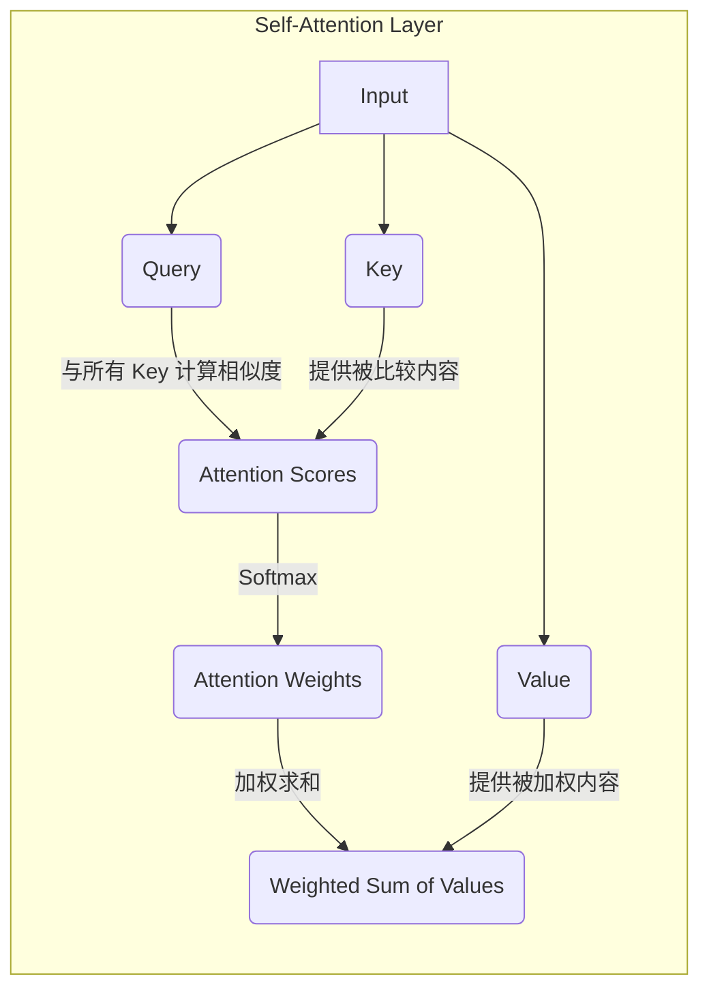

# 为什么展平是可行的：Transformer 如何重建结构信息

> **最后更新**: 2025年11月18日  
> **问题**: 将一个二维的 CSI 矩阵展平（Flatten）成一维序列，不会丢失重要的空间/频率结构信息吗？为什么这种做法在 Transformer 中是有效的？

---

## 核心答案

简单来说，**展平是可行的，因为它把“结构信息”的学习任务交给了两个关键机制：位置编码（Positional Encoding）和自注意力（Self-Attention）。**

当你把一个 `(64, 64)` 的 CSI 矩阵展平成一个 `4096` 的长序列时，你确实丢失了明确的二维结构（即哪些是相邻的子载波，哪些是相邻的天线）。Transformer 通过以下两步来弥补甚至超越这种局限：

---

### 1. 位置编码 (Positional Encoding)：重新注入“位置感”

-   **问题**: 展平后，模型不知道 token 10 和 token 11 是“相邻”的，也不知道 token 10 和 token 74 (64+10) 在原始矩阵中是对齐的（同一子载波，不同天线）。序列中的所有 token 在模型看来都是无序的。

-   **解决方案**: 在将序列送入 Transformer 主体之前，我们为每个 token **加上一个独一无二的“位置向量”**。
    -   这个向量通常由 `sin` 和 `cos` 函数生成，它为序列中的每个位置（0, 1, 2, ...）创建一个高维度的、独特的嵌入表示。
    -   **关键特性**: 这种编码方式不仅能表示每个 token 的**绝对位置**（例如，这是第 10 个 token），还能让模型轻易地学习到**相对位置**。因为对于任意固定的偏移量 `k`，`pos+k` 的位置编码可以由 `pos` 的位置编码线性表示。
    -   **效果**: 因此，即使数据被展平，模型也能通过位置编码“感知”到每个数据点在原始结构中的坐标。它学会了：“哦，这个 token 的位置编码告诉我它在原始矩阵的第 2 行第 3 列”。

```mermaid
graph TD
    subgraph "Input Pipeline"
        A[原始矩阵 (64, 64)] --> B[展平序列 (4096)];
        B --> C[Token 嵌入 (4096, 256)];
        D[位置编码 (4096, 256)] --> E{相加};
        C --> E;
        E --> F[模型输入 (4096, 256)];
    end
    style D fill:#cde, stroke:#333
```

### 2. 自注意力机制 (Self-Attention)：学习任意两点间的关系

-   **问题**: 知道了位置还不够，模型需要理解这些位置之间的**相关性**（例如，相邻子载波的信道响应通常是相似的，而远距离的子载波可能不相关）。

-   **解决方案**: 这是 Transformer 最强大的地方。自注意力机制允许序列中的**每一个 token 直接与所有其他 token 进行交互**，并为它们之间的关系计算一个“注意力分数”。
    -   **全局感受野 (Global Receptive Field)**: 与 CNN（只能看到局部邻域）或 RNN（主要关注前后几个时间步）不同，Transformer 的一个 token 可以“一眼看到”整个序列中的所有其他 token。
    -   **学习结构**: 这意味着，代表 `(子载波=1, 天线=1)` 的 token 可以直接与代表 `(子载波=50, 天线=60)` 的 token 互动。通过训练，模型会学到：
        -   **频率相关性**: 相邻子载波的 token 之间应该有更高的注意力分数。
        -   **空间相关性**: 相邻天线的 token 之间也应该有更高的注意力分数。
        -   **长程依赖 (Long-range Dependencies)**: 甚至可以学到一些非局部的、跨越整个信道矩阵的复杂物理模式（例如特定天线阵列的旁瓣效应）。



---

### 总结与类比

你可以把这个过程想象成：

1.  **展平**: 把一幅画的所有像素拆开，排成一长队。
2.  **位置编码**: 给每个像素贴上一个标签，写着它原来的坐标 `(x, y)`。
3.  **自注意力**: 让每个像素都能看到所有其他像素和它们的坐标标签。通过学习，像素们会发现“跟我坐标相近的像素，颜色也应该相近”，从而在内部重建出整幅画的结构和内容。

---

### 结论

展平是一种将任意结构化数据（如图像、音频、CSI矩阵）“喂给”标准 Transformer 模型的有效技巧。它将**显式的结构信息**（如二维网格）转化为**隐式的、可学习的关系**。

对于 CSI 这种内部存在丰富且复杂相关性的数据，自注意力的全局建模能力使其非常适合学习这些潜在的物理模式，即便输入只是一个看似无结构的一维序列。模型自己学会了什么是“重要的结构”。