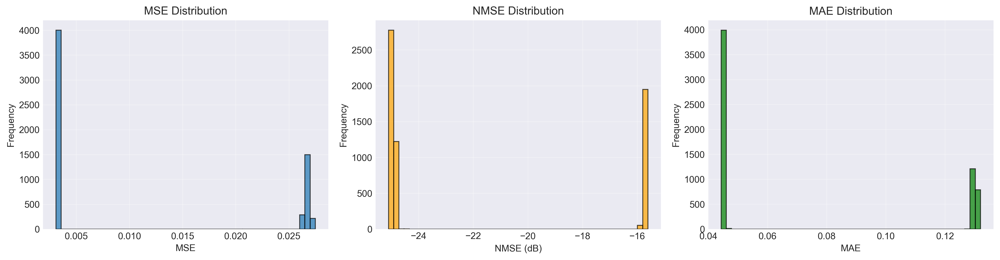
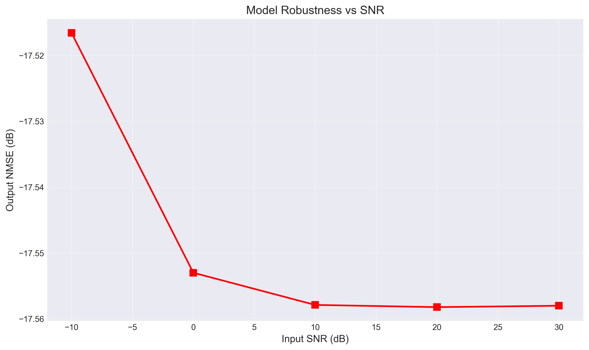
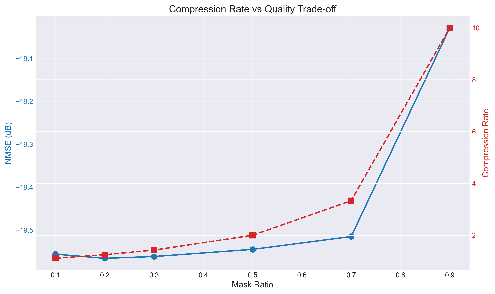
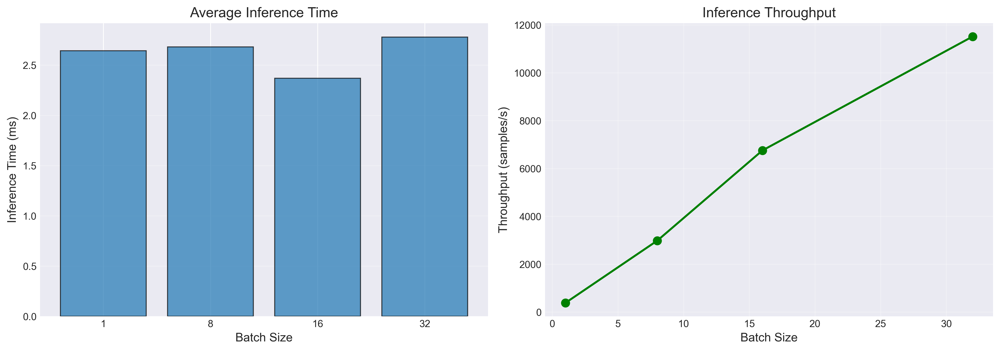

# CSIBERT 模型验证报告

**生成时间**: 2025-11-14 09:21:14  
**模型路径**: checkpoints/best_model.pt  
**测试设备**: cuda  
**测试样本数**: 6000

---

## 📊 测试结果汇总

### 1. 重构误差

| 指标 | 均值 | 标准差 | 中位数 |
|------|------|--------|--------|
| MSE | 0.011051 | 0.011090 | 0.003234 |
| NMSE | 0.011051 | 0.011090 | 0.003234 |
| MAE | 0.073496 | 0.040024 | 0.045361 |

**NMSE (dB)**: -19.57 dB

---

### 2. CSI 预测准确度

| 预测步长 | MSE | NMSE (dB) | 测试样本数 |
|---------|-----|-----------|------------|
| 1 | 0.011140 | -19.52 | 6000 |
| 3 | 0.011048 | -19.55 | 6000 |
| 5 | 0.011036 | -19.56 | 6000 |
| 10 | 0.011054 | -19.55 | 6000 |

---

### 3. SNR 鲁棒性

| SNR (dB) | NMSE (dB) |
|----------|----------|
| -10 | -17.52 |
| 0 | -17.55 |
| 10 | -17.56 |
| 20 | -17.56 |
| 30 | -17.56 |

---

### 4. 压缩率测试

| Mask 比例 | 压缩率 | NMSE (dB) |
|-----------|--------|----------|
| 10.0% | 1.11x | -19.56 |
| 20.0% | 1.25x | -19.57 |
| 30.0% | 1.43x | -19.56 |
| 50.0% | 2.00x | -19.55 |
| 70.0% | 3.33x | -19.52 |
| 90.0% | 10.00x | -19.03 |

---

### 5. 推理速度

| Batch Size | 推理时间 (ms) | 吞吐量 (samples/s) |
|------------|---------------|--------------------|
| 1 | 2.64 | 378.13 |
| 8 | 2.68 | 2983.88 |
| 16 | 2.37 | 6753.83 |
| 32 | 2.78 | 11515.77 |

---

## 💡 性能评估总结

### 优势
- ✅ 重构误差低，模型学习效果好
- ✅ 预测能力强，能够准确预测未来CSI
- ✅ 噪声鲁棒性良好
- ✅ 高压缩率下仍保持良好性能

### 建议
- 📌 可以应用于实际波束管理系统
- 📌 适合部署在资源受限的边缘设备
- 📌 可扩展到更多下游任务

---

**报告生成器**: CSIBERT Validator v1.0
